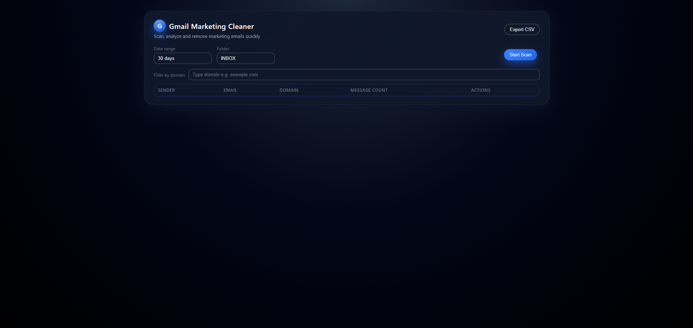
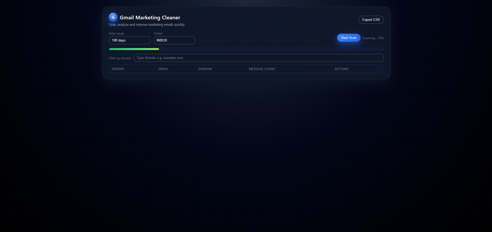
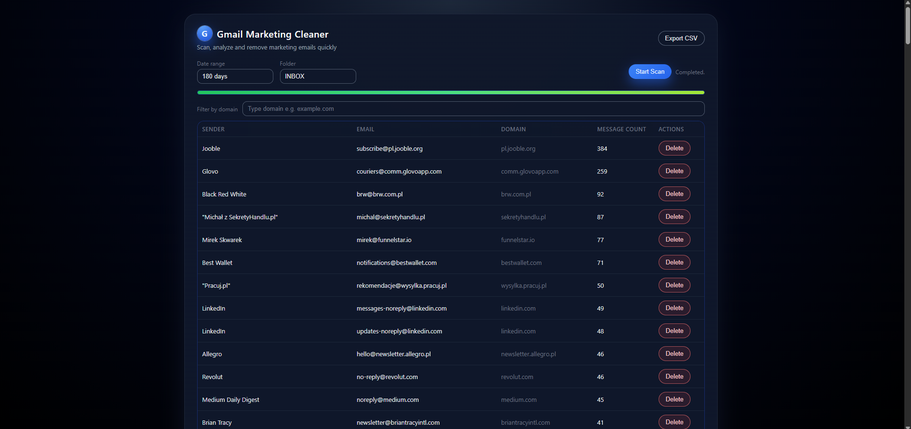
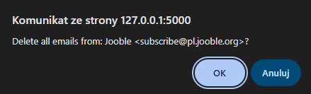

# Gmail Newsletter Cleaner

A fast, local, and privacy‑respecting tool for cleaning newsletters and marketing emails from your Gmail inbox.  
It scans your mailbox using the official Gmail API, identifies marketing senders, and lets you remove all messages from any sender with a single click—all while running entirely on your machine. No data is sent anywhere except directly to Google's official API.

---

## 🎥 Demo

https://youtu.be/Pikt5T1NnwM


## ✨ Features

- **Fast batch scanning** using Gmail API batch requests (up to 100 messages per request)
- **Real‑time progress bar** during scanning
- **Modern web UI** built with Flask templates + static JS/CSS
- **Sender statistics** (email address, domain, message count)
- **Domain filtering** directly in the UI
- **Interactive column sorting** (sender, email, domain, count)
- **Bulk deletion** of all messages from selected senders
- **CSV export** of all detected marketing senders
- **Configurable scan parameters**:
  - Date range (7 / 30 / 60 / 180 / 365 days)
  - Gmail category (INBOX / Promotions / Social / Updates)
- **Local caching** for instant reloads on subsequent scans
- **Zero external servers** — everything runs locally on your machine

---

## 📸 Screenshots

*(Add screenshots to the `screenshots/` directory and uncomment below)*








---

## 🛠️ Installation

### 1. Clone the repository
```bash
git clone https://github.com/<your-username>/gmail-newsletter-cleaner.git
cd gmail-newsletter-cleaner
```

### 2. Install dependencies
```bash
pip install -r requirements.txt
```

### 3. Enable Gmail API
1. Go to the [Google Cloud Console](https://console.cloud.google.com/)
2. Create a new project
3. Enable the **Gmail API**
4. Create OAuth credentials → **Desktop App** type
5. Download the `credentials.json` file
6. Place it in the project root (same folder as `botMailAdds.py`)

### 4. First run
The first launch will open your browser to log in and authorize Gmail access.  
OAuth tokens (`token.json`) will be saved locally and reused for future sessions.

---

## 🚀 Usage

1. Start the web panel:
   ```bash
   python web_panel.py
   ```

2. Open in your browser:  
   `http://127.0.0.1:5000/`

3. In the UI:
   - Select a date range
   - Choose a Gmail category (e.g., Promotions)
   - Click **Start Scan**
   - Wait for the progress bar to complete
   - Review detected marketing senders
   - Filter by domain or sort columns as needed
   - Delete unwanted senders or export results to CSV

---

## 🔒 Privacy & Security

- Runs **entirely locally** on your machine
- No data is uploaded to third-party servers—only direct communication with Google's official API
- OAuth tokens (`token.json`, `credentials.json`) are excluded from version control via `.gitignore`
- Local cache (`cache.json`) is also ignored and never shared

---

## 📂 Project Structure

```
botMailAdds.py        # Gmail API integration and scanning logic
web_panel.py          # Flask backend and route handlers
templates/index.html  # Main UI template
static/css/style.css  # Stylesheet
static/js/app.js      # Frontend interactivity
screenshots/          # UI preview images
requirements.txt      # Python dependencies
README.md             # This documentation
LICENSE               # MIT license
.gitignore            # Excludes sensitive/local files
```

---

## 🧭 Roadmap

- [ ] Incremental scanning (process only new messages since last scan)
- [ ] Automatic scheduled cleanup mode
- [ ] Multi‑user OAuth support (SaaS version)
- [ ] ML‑based marketing email classifier
- [ ] Dark mode UI theme
- [ ] Docker image for easy deployment

---

## 🤝 Contributing

Pull requests and issue reports are welcome!  
For major changes, please open an issue first to discuss your proposed improvements.

---

*Your inbox, simplified—without compromising your privacy.*
